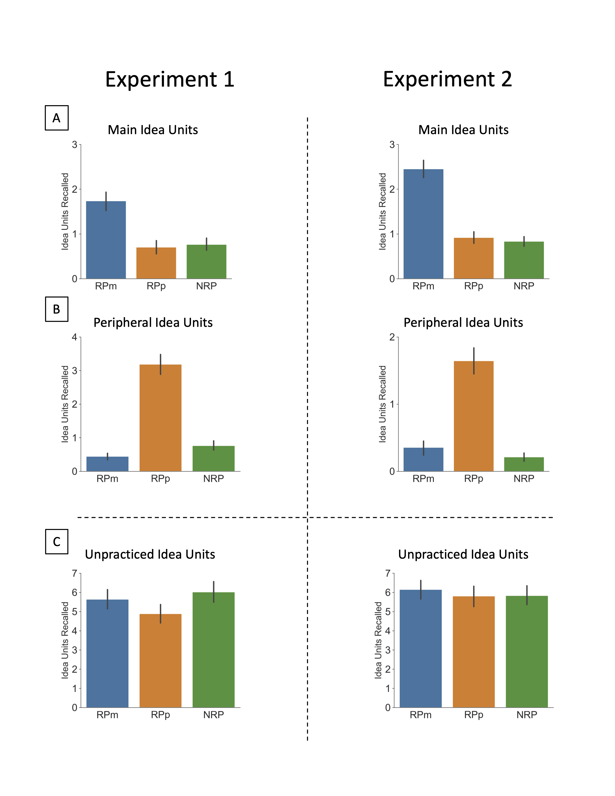
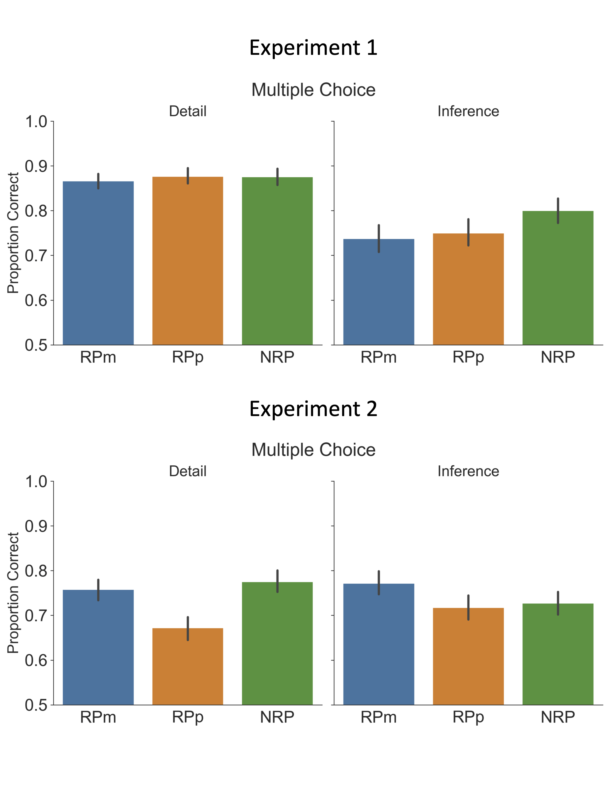
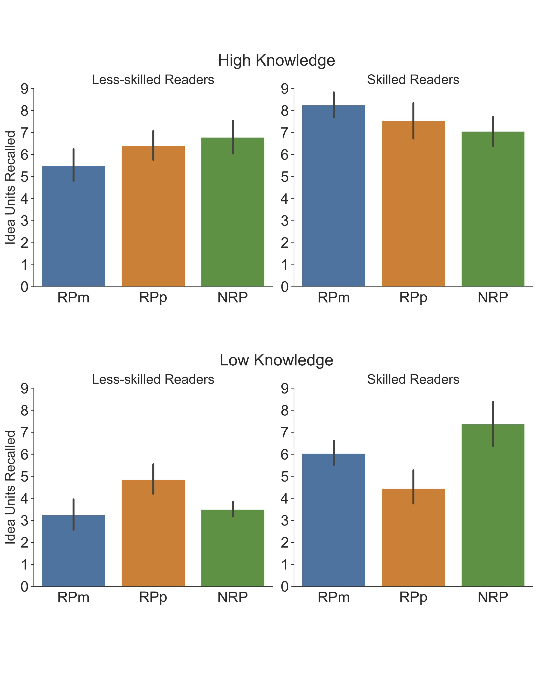

## A repository for the analysis and visualization code used in *The limited reach of retrieval practice: Practice of science text material enhances retention of practiced material, but unpracticed material is unaffected.* Reilly W.B., Antony. J.W., & Ranganath, C. (in prep)

### Project Description

Retrieval practice is well known to enhance retention of practiced material, but can enhance or impair retention of unpracticed material. In educational texts, the effects of retrieval practice are not well understood. We explored the effects of retrieval practice in science texts by having participants practice retrieval of "main ideas" and "peripheral ideas" after reading a science text. We predicted that retrieval practice would enhance retention of practiced material in both conditions, relative to a control condition that did not practice any material. Furthermore, we predicted that practice of main ideas would enhance retention of additional information that was not practiced, and that practice of peripheral ideas would imapir retention of additional information. Finally, we collected individual difference variables that we expected to moderate the effects of retrieval practice. 

Our results showed robust increases in retention for practiced material, regardless of whether participants were skilled or less-skilled readers, or had more or less prior knowledge. For unpracticed material, we observed inconsistent evidence that retrieval practice impacted retention. The upside of these results is that educators need not be concerned that retrieval practice (formative assessments) will have unequal benefits for their students, and that practicing material that is peripheral rather than central to a text passage does not have negative effects. The downside is that retrieval practice has rather focal retention benefits.

### Contents

This repository includes the scripts used to munge, analyze, and visualize the data and the resulting figures. It also includes html files that contain the code and output from all statistical analyses.

### Key scripts

`preprocessing.py` Run interactively. Combines the three experimental phases, engineers features, identifies bad data, and outputs clean dataframes.

`publication_ready_plots.py` Produces the manuscript's figures. 

`viruses_stats_imac2.Rmd` Experiment 1 statistical analyses. Control analyses, recall model selection and analyses, multiple choice model selection and analyses. 

`endocrine_stats_imac2.Rmd` Experiment 2 statistical analyses. Control analyses, recall model selection and analyses, multiple choice model selection and analyses. 

`bayes_factor.Rmd` Bayes Factor analyses for Experiment 1 and 2.

### Figure 1. 

	

Recall Performance. Mean idea units recalled on the final free recall test for each type of idea unit for Experiment 1 (viruses text) and Experiment 2 (endocrine text). Main idea units were practiced by the RPm group only. Peripheral idea units were practiced by the RPp group only. The NRP group did not practice any idea units. Panels A and B depict the “testing effect” in that retention of main ideas and peripheral ideas were greatest for the RPm and RPp groups, respectively. Panel C depicts recall of unpracticed idea units (all idea units not included in previous two panels). Error bars indicate standard error of the mean. 

### Figure 2. 

	

Multiple Choice Performance. Mean proportion correct on the multiple-choice final test. Error bars represent standard error of the mean.

### Figure 3. 

	

Effects of reading ability and domain knowledge on recall in Experiment 2. Bootstrap analyses of unpracticed idea units in the endocrine text (Experiment 2) revealed a significant three-way interaction between participant group, reading ability, and prior knowledge. For visualization purposes, participants were divided with a median split according to prior knowledge and reading ability. Error bars represent standard error of the mean of each cell.

### Tools

